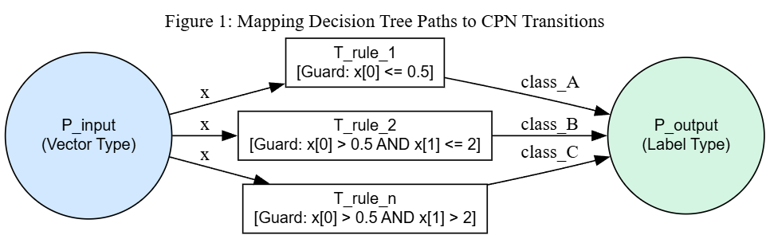
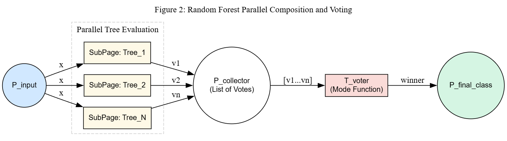
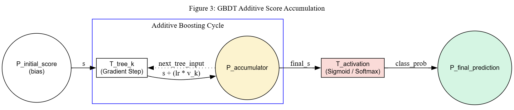

Formal Verification
===================

Formalization of the Conversion: Tree Models to Hierarchical Coloured Petri Nets (HCPN)
----------------------------------------------------------------------------------------

This section documents the mathematical foundation used by pyRuleAnalyzer to translate machine learning models (DT, RF, GBDT) into formal representations amenable to verification and structural analysis. The formalization employs **Hierarchical Coloured Petri Nets** (HCPN), which extend flat CPNs with module composition, substitution transitions, port-socket bindings, and fusion places. This enables a natural, layered representation where individual decision trees are reusable leaf modules composed into larger ensemble structures.

1. Formal Definitions
^^^^^^^^^^^^^^^^^^^^^

**1.1 Coloured Petri Net**

A Coloured Petri Net (CPN) is the standard 9-tuple:

.. math::

   CPN = (\Sigma, P, T, A, N, C, G, E, I)

.. list-table::
   :header-rows: 1
   :widths: 15 85

   * - Element
     - Description
   * - :math:`\Sigma`
     - **Colour sets.** The data types carried by tokens: :math:`\text{VEC} = \mathbb{R}^d` (feature vectors), :math:`\text{LABEL}` (finite set of class labels), :math:`\text{PROB} = [0,1]^{|C|}` (probability vectors, used by RF), :math:`\text{SCORE} = \mathbb{R}` (real-valued scores, used by GBDT), and :math:`\text{STAGE} = \{1, 2, \dots, K{+}1\} \subset \mathbb{N}` (stage counter, used by GBDT to enforce sequential accumulation).
   * - :math:`P`
     - **Places.** The set of places within the net.
   * - :math:`T`
     - **Transitions.** The set of transitions within the net.
   * - :math:`A`
     - **Arcs.** Directed connections between places and transitions.
   * - :math:`N`
     - **Node function.** Maps each arc to its source and destination nodes, defining the net topology.
   * - :math:`C`
     - **Colour function.** Assigns colour sets to places (e.g. :math:`C(P_{in}) = \text{VEC}`, :math:`C(P_{out}) = \text{LABEL}`).
   * - :math:`G`
     - **Guards.** Boolean expressions on transitions: :math:`G(t_i) = \bigwedge_{j \in C_i} (x_{feat} \text{ op } \theta_j)`.
   * - :math:`E`
     - **Arc expressions.** Define how tokens flow. Input arcs: :math:`E(P_{in} \to t_i) = x`. Output arcs: :math:`E(t_i \to P_{out}) = v_i`.
   * - :math:`I`
     - **Initialization.** The initial marking of the net's places.

**1.2 CPN Module**

A CPN module extends a flat CPN with an interface for hierarchical composition:

.. math::

   CPN\_module = (CPN, T_{sub}, P_{port}, PT)

where:

.. list-table::
   :header-rows: 1
   :widths: 15 85

   * - Element
     - Description
   * - :math:`CPN`
     - A non-hierarchical Coloured Petri Net :math:`CPN = (\Sigma, P, T, A, N, C, G, E, I)` as defined in Section 1.1.
   * - :math:`T_{sub} \subseteq T`
     - **Substitution transitions.** A subset of transitions that are placeholders for entire sub-modules. When a substitution transition is "refined", it is replaced by the internal net of the referenced sub-module.
   * - :math:`P_{port} \subseteq P`
     - **Port places.** A subset of places that serve as the module's interface with its parent. Tokens cross module boundaries exclusively through port places.
   * - :math:`PT : P_{port} \to \{In, Out, In/Out\}`
     - **Port-type function.** Assigns a direction to each port place: *In* (tokens flow into the module), *Out* (tokens flow out), or *In/Out* (bidirectional).

**1.3 Hierarchical Coloured Petri Net**

An HCPN composes multiple CPN modules into a hierarchical structure:

.. math::

   HCPN = (S, SM, PS, FS)

where:

.. list-table::
   :header-rows: 1
   :widths: 15 85

   * - Element
     - Description
   * - :math:`S`
     - **Modules.** A finite set of CPN modules. Each module is a self-contained net with its own places, transitions, and port interface.
   * - :math:`SM : T_{sub} \to S`
     - **Submodule function.** Maps each substitution transition (across all modules) to the module it represents. The resulting module hierarchy must be **acyclic** (i.e. it forms a directed acyclic graph of module references).
   * - :math:`PS`
     - **Port-socket relation.** For each substitution transition :math:`t \in T_{sub}` and each port place :math:`p` of :math:`SM(t)`, :math:`PS` assigns a *socket place* :math:`p'` in the parent module such that :math:`C(p) = C(p')`. Sockets are the "attachment points" through which the parent communicates with the sub-module.
   * - :math:`FS \subseteq 2^P`
     - **Fusion sets.** Each element of :math:`FS` is a nonempty set of places (possibly from different modules) that are identified as a single logical place. All places in a fusion set share the same colour set and marking at all times. This allows multiple modules to share a common place without explicit arcs between them.

2. Decision Tree
^^^^^^^^^^^^^^^^^

**Definition:** A Decision Tree :math:`DT` is a set of rules :math:`R = \{r_1, r_2, \dots, r_n\}` that are exhaustive and mutually exclusive. Each rule :math:`r` is defined by a pair :math:`(C, v)`, where :math:`C` is the set of split conditions and :math:`v` is the resulting class.

**CPN Module** :math:`s_{DT}`:

The Decision Tree is the **atomic leaf module** of the hierarchy — it contains no substitution transitions. Its definition is:

.. math::

   s_{DT} = (CPN_{DT}, \; T_{sub} = \emptyset, \; P_{port} = \{P_{in}, P_{out}\}, \; PT)

with:

* :math:`PT(P_{in}) = In` — the input feature vector enters through this port.
* :math:`PT(P_{out}) = Out` — the classification result exits through this port.
* :math:`T_{sub} = \emptyset` — no substitution transitions; all transitions are regular rule transitions.

**Mapping** :math:`\Psi(DT \to s_{DT})`:

Each rule :math:`r_i = (C_i, v_i)` is converted into a guarded transition :math:`t_i`:

* **Input arc:** :math:`(P_{in}, t_i)` consumes the feature vector token :math:`x`.
* **Guard:** :math:`G(t_i) = \bigwedge_{j \in C_i} (x_{feat_j} \text{ op } \theta_j)`, the conjunction of all split conditions along the path from root to leaf.
* **Output arc:** :math:`(t_i, P_{out})` produces the class label :math:`v_i`.

The figure below shows the CPN structure for a Decision Tree module. The input port place :math:`P_{input}` (colour type :math:`\text{VEC}`) holds the feature vector token :math:`x`, which is available to all transitions via their input arcs. Each transition :math:`T\_rule\_i` has a guard composed of the conjunction of split predicates along its tree path. Since the guards are derived from complementary ``<=`` / ``>`` splits at every internal node, exactly one transition is enabled for any complete input, consuming :math:`x` and depositing the class label in :math:`P_{output}`.

   CPN module :math:`s_{DT}`: all leaf paths of a Decision Tree become guarded transitions between port places :math:`P_{input}` (In) and :math:`P_{output}` (Out).

**Invariance Property:** Due to the mutually exclusive nature of the rules in a DT, for any initial marking :math:`M_0` containing an input token :math:`x \in \mathbb{R}^d`, exactly one transition :math:`t \in T` will be enabled, guaranteeing total determinism within the module.

.. note::

   This property holds under the assumption that the input vector :math:`x` contains a value for every feature used by the tree. If any feature is missing, no transition may be enabled and the net falls back to the classifier's default class.

3. Ensemble Models
^^^^^^^^^^^^^^^^^^^

The HCPN framework enables a natural representation of ensemble models: each individual tree is an instance of the leaf module :math:`s_{DT}`, composed into higher-level modules via substitution transitions, port-socket bindings, and fusion places.

3.1 Random Forest
""""""""""""""""""

For a Random Forest with :math:`N` trees, the HCPN is:

.. math::

   HCPN_{RF} = (S_{RF}, \; SM_{RF}, \; PS_{RF}, \; FS_{RF})

**Modules** :math:`S_{RF} = \{s_{RF}, \; s_{DT}\}`:

* :math:`s_{RF}` — the **top-level module** containing the voting logic.
* :math:`s_{DT}` — the **leaf module** (Section 2), reused :math:`N` times.

**Top-level module** :math:`s_{RF}`:

.. math::

   s_{RF} = (CPN_{RF}, \; T_{sub} = \{t_{tree_1}, \dots, t_{tree_N}\}, \; P_{port} = \{P_{in}, P_{out}\}, \; PT)

with:

* :math:`P = \{P_{in}, P_{collect}, P_{out}\}` — input, collector, and output places.
* :math:`C(P_{in}) = \text{VEC}`, :math:`C(P_{collect}) = \text{PROB}`, :math:`C(P_{out}) = \text{LABEL}`.
* :math:`T = \{t_{tree_1}, \dots, t_{tree_N}, \; t_{vote}\}` — :math:`N` substitution transitions plus one regular aggregation transition.
* :math:`t_{vote}` — a regular transition (not in :math:`T_{sub}`) that performs soft voting.

**Submodule function** :math:`SM_{RF}`:

.. math::

   SM_{RF}(t_{tree_k}) = s_{DT} \quad \text{for } k = 1, \dots, N

Each substitution transition :math:`t_{tree_k}` is refined into the DT leaf module. Although the same module *definition* :math:`s_{DT}` is referenced :math:`N` times, each instance carries its own rule set (extracted from the :math:`k`-th tree in the forest).

**Port-socket bindings** :math:`PS_{RF}`:

For each substitution transition :math:`t_{tree_k}`:

* The *In* port :math:`P_{in}` of :math:`s_{DT}` is bound to socket :math:`P_{in}` in :math:`s_{RF}`.
* The *Out* port :math:`P_{out}` of :math:`s_{DT}` is bound to socket :math:`P_{collect}` in :math:`s_{RF}`.

Colour compatibility is ensured: the DT module's output port produces :math:`\text{PROB}` vectors (the normalised class distribution at the matched leaf), matching :math:`C(P_{collect}) = \text{PROB}`.

.. note::

   In the RF context, the DT module's output arc expression is adapted: instead of depositing a discrete label, it yields the normalised class distribution :math:`\mathbf{p}_k \in [0,1]^{|C|}` at the matched leaf. The port colour is therefore :math:`\text{PROB}` rather than :math:`\text{LABEL}`.

**Fusion set** :math:`FS_{RF}`:

.. math::

   FS_{RF} = \{\{P_{in}\}\}

The input place :math:`P_{in}` is a **fusion place** shared across the top module and all :math:`N` DT sub-module instances. Every tree evaluates the same input token :math:`x` without duplicating it.

**Soft Voting (transition** :math:`t_{vote}` **):**

The aggregation transition :math:`t_{vote}` consumes all :math:`N` probability tokens from :math:`P_{collect}` (enabled only when :math:`|P_{collect}| \geq N`). Its output arc expression computes:

.. math::

   \bar{\mathbf{p}} = \frac{1}{N} \sum_{k=1}^{N} \mathbf{p}_k, \qquad v_{final} = \arg\max_{c} \; \bar{p}_c

This matches the default behaviour of scikit-learn's ``RandomForestClassifier``, which uses soft voting via ``predict_proba`` averaging.

The following figure shows the parallel composition. Each sub-page :math:`Tree_k` is an independent CPN module whose output probability vector is collected in :math:`P_{collector}`. The aggregation transition :math:`T_{voter}` computes the averaged probabilities and deposits the winning class in :math:`P_{final\_class}`.

   HCPN for Random Forest: :math:`N` substitution transitions (each refining to a DT module) feed probability vectors into a collector place, followed by a soft-voting aggregation transition.

.. note::

   The figure labels the aggregation transition as "Mode Function" for visual simplicity. In the actual implementation, soft voting (probability averaging) is used as the primary path; hard voting (mode) exists only as a fallback when class distribution data is unavailable.

3.2 GBDT
"""""""""

In Gradient Boosting, classification is performed by sequential accumulation of real-valued scores. The implementation follows scikit-learn's One-vs-Rest (OVR) scheme: for a problem with :math:`|C|` classes, there are :math:`|C|` independent score channels.

The GBDT model is represented as a 3-level HCPN:

.. math::

   HCPN_{GBDT} = (S_{GBDT}, \; SM_{GBDT}, \; PS_{GBDT}, \; FS_{GBDT})

**Modules** :math:`S_{GBDT} = \{s_{GBDT}, \; s_{channel}, \; s_{DT}\}`:

* :math:`s_{GBDT}` — the **top-level module** with class-channel substitution transitions and the activation transition.
* :math:`s_{channel}` — the **mid-level module** representing a single class channel's sequential boosting loop.
* :math:`s_{DT}` — the **leaf module** (Section 2), reused :math:`|C| \times K` times (once per boosting stage per class).

**3.2.1 Top-Level Module** :math:`s_{GBDT}`

.. math::

   s_{GBDT} = (CPN_{GBDT}, \; T_{sub} = \{{t_{ch}}^{(1)}, \dots, {t_{ch}}^{(|C|)}\}, \; P_{port} = \{P_{in}, P_{out}\}, \; PT)

with:

* :math:`P = \{P_{in}, \; {P_{score}}^{(1)}, \dots, {P_{score}}^{(|C|)}, \; P_{out}\}`.
* :math:`C(P_{in}) = \text{VEC}`, :math:`C({P_{score}}^{(c)}) = \text{SCORE}`, :math:`C(P_{out}) = \text{LABEL}`.
* :math:`T = \{{t_{ch}}^{(1)}, \dots, {t_{ch}}^{(|C|)}, \; t_{act}\}` — :math:`|C|` substitution transitions (one per class channel) plus one regular activation transition.

**Submodule function:**

.. math::

   SM_{GBDT}({t_{ch}}^{(c)}) = s_{channel} \quad \text{for } c = 1, \dots, |C|

**Port-socket bindings** for each :math:`{t_{ch}}^{(c)}`:

* :math:`P_{in}` (In port of :math:`s_{channel}`) :math:`\leftrightarrow` :math:`P_{in}` (socket in :math:`s_{GBDT}`).
* :math:`P_{result}` (Out port of :math:`s_{channel}`) :math:`\leftrightarrow` :math:`{P_{score}}^{(c)}` (socket in :math:`s_{GBDT}`).

**3.2.2 Mid-Level Module** :math:`s_{channel}` **(Boosting Loop)**

Each class channel is a module that sequentially accumulates contributions from :math:`K` boosting stages:

.. math::

   s_{channel} = (CPN_{ch}, \; T_{sub} = \{{t_{stage}}^{(1)}, \dots, {t_{stage}}^{(K)}\}, \; P_{port} = \{P_{in}, P_{result}\}, \; PT)

with:

* :math:`P = \{P_{in}, \; P_{accum}, \; P_{stage}, \; P_{result}\}`.
* :math:`C(P_{in}) = \text{VEC}`, :math:`C(P_{accum}) = \text{SCORE}`, :math:`C(P_{stage}) = \text{STAGE}`, :math:`C(P_{result}) = \text{SCORE}`.
* :math:`PT(P_{in}) = In`, :math:`PT(P_{result}) = Out`.
* :math:`T = \{{t_{stage}}^{(1)}, \dots, {t_{stage}}^{(K)}, \; t_{finalize}\}` — :math:`K` substitution transitions (one per boosting stage) plus a finalize transition.

**Initial marking:**

* :math:`I(P_{accum}) = \{s_0\}` — the initial score (bias) derived from scikit-learn's prior estimator (``DummyClassifier``):

.. math::

   {s_0}^{(\text{binary})} = \ln\!\frac{p}{1-p}, \qquad {s_{0,c}}^{(\text{multi})} = \ln p_c - \frac{1}{|C|}\sum_j \ln p_j

* :math:`I(P_{stage}) = \{1\}` — stage counter starts at 1.

**Submodule function:**

.. math::

   SM_{ch}({t_{stage}}^{(k)}) = s_{DT} \quad \text{for } k = 1, \dots, K

Each substitution transition :math:`{t_{stage}}^{(k)}` is refined into a DT leaf module containing the rules of the :math:`k`-th boosting tree for this class channel.

**Port-socket bindings** for each :math:`{t_{stage}}^{(k)}`:

* :math:`P_{in}` (In port of :math:`s_{DT}`) :math:`\leftrightarrow` :math:`P_{in}` (socket in :math:`s_{channel}`).
* :math:`P_{out}` (Out port of :math:`s_{DT}`) :math:`\leftrightarrow` :math:`P_{accum}` (socket in :math:`s_{channel}`).

**Sequential accumulation logic:**

The stage counter :math:`\kappa \in P_{stage}` enforces sequential firing. For each stage :math:`k`:

* **Guard on** :math:`{t_{stage}}^{(k)}`: :math:`[\kappa = k]` — the substitution transition is only enabled at the correct stage.
* After the DT sub-module fires (exactly one rule matches, producing :math:`\eta \cdot {v_k}^{(c)}`), the channel module's arc expressions update:

  - :math:`P_{accum} \leftarrow s + \eta \cdot {v_k}^{(c)}` (accumulated score).
  - :math:`P_{stage} \leftarrow \kappa + 1` (advance counter).

**Finalize transition** :math:`t_{finalize}`:

Guarded by :math:`[\kappa = K{+}1]`, this regular transition consumes the final accumulated score from :math:`P_{accum}` and deposits it in the output port :math:`P_{result}`.

.. note::

   Within each boosting stage, the DT sub-module's internal mutual exclusivity guarantees that exactly one leaf fires. The stage counter ensures strict sequential ordering across stages, so at most one substitution transition is enabled at any time.

**3.2.3 Activation Transition** :math:`t_{act}`

After all :math:`|C|` channel modules complete (each depositing a terminal score in :math:`{P_{score}}^{(c)}`), the activation transition :math:`t_{act}` in the top-level module :math:`s_{GBDT}` fires. It is a **synchronization transition** with :math:`|C|` input arcs — one from each :math:`{P_{score}}^{(c)}` — collecting the terminal scores :math:`{s_K}^{(1)}, {s_K}^{(2)}, \dots, {s_K}^{(|C|)}` in a single atomic step. The activation is a two-step process:

1. **Probability computation:**

.. math::

   p^{(\text{binary})} = \sigma(s_K) = \frac{1}{1 + e^{-s_K}}, \qquad {\mathbf{p}_c}^{(\text{multi})} = \frac{e^{{s_K}^{(c)}}}{\sum_j e^{{s_K}^{(j)}}} \;\text{(softmax)}

2. **Decision:**

.. math::

   \hat{y} = \begin{cases}
   1 & \text{if } p^{(\text{binary})} \geq 0.5 \quad \text{(binary)} \\[4pt]
   \arg\max_c \; {s_K}^{(c)} & \text{(multiclass)}
   \end{cases}

.. note::

   In the multiclass case, because softmax is a monotonic transformation, :math:`\arg\max` can be applied directly to the raw scores :math:`{s_K}^{(c)}` without computing the softmax probabilities, which is what the implementation does.

**Fusion set** :math:`FS_{GBDT}`:

.. math::

   FS_{GBDT} = \{\{P_{in}\}\}

The input place :math:`P_{in}` is fused across the top module, all channel sub-modules, and all DT sub-module instances. Every tree in every channel evaluates the same input vector :math:`x`.

**Summary of the OVR score accumulation:**

.. math::

   {s_K}^{(c)} = {s_0}^{(c)} + \sum_{k=1}^{K} \eta \cdot {v_k}^{(c)}

where :math:`K` is the number of boosting stages, :math:`\eta` is the learning rate, and :math:`{v_k}^{(c)}` is the leaf value of the matched rule in tree :math:`k` for class :math:`c`.

The figure below depicts the additive composition for a single class channel. The place :math:`P_{initial\_score}` holds the bias token :math:`s_0`. Inside the additive boosting cycle, each gradient step transition :math:`T_{tree\_k}` adds :math:`\eta \cdot v_k` to the accumulator. After the final iteration, the activation transition :math:`T_{activation}` (sigmoid or softmax) converts the raw score into a class probability and deposits the result in :math:`P_{final\_prediction}`. For multiclass problems, :math:`|C|` such channels operate in parallel, and the activation transition collects all channel scores before producing the final label.

   HCPN for GBDT (single class channel view): initial bias score, sequential accumulation via substitution transitions (each refining to a DT module), and a final activation transition (sigmoid/softmax).

4. Rule Extraction Algorithm
^^^^^^^^^^^^^^^^^^^^^^^^^^^^^

The conversion follows the flow implemented in ``rule_classifier.py``, which constructs the HCPN module hierarchy:

1. **Prior Extraction (GBDT only):** Queries scikit-learn's prior estimator to compute the initial score :math:`s_0` (log-odds for binary, centred log-priors for multiclass). This value becomes the initial token in the channel module's :math:`P_{accum}` place.
2. **Traversal:** Recursively traverses each tree structure from root to each leaf node. At every internal node, the left child receives a ``<=`` predicate and the right child receives a ``>`` predicate over the same feature and threshold. Each complete root-to-leaf path produces a rule that becomes a guarded transition within a :math:`s_{DT}` leaf module.
3. **Predicate Construction:** Concatenates the accumulated split decisions along the path into a boolean conjunction that becomes the transition guard :math:`G(t_i)`.
4. **Module Assembly:** Maps the extracted rules into the HCPN hierarchy:

   * **DT:** A single :math:`s_{DT}` module with all rules as transitions.
   * **RF:** A top module :math:`s_{RF}` with :math:`N` substitution transitions, each bound to a :math:`s_{DT}` instance. The fusion set shares :math:`P_{in}`.
   * **GBDT:** A 3-level hierarchy: :math:`s_{GBDT} \to s_{channel} \to s_{DT}`, with :math:`|C|` channel instances and :math:`K` tree instances per channel.

5. **Rule Encapsulation:** Maps each path into a :ref:`Rule<rule>` object. For DT/RF, the rule stores the class label and class distribution (sample counts at the leaf). For GBDT, the rule additionally stores the raw ``leaf_value``, the ``learning_rate``, and the ``class_group``, from which the effective contribution :math:`\eta \cdot v` is computed.

.. note::

   By converting ML models into an HCPN representation, it becomes possible to apply state-space analysis methods at each hierarchical level — detecting unreachable rules within leaf modules, verifying synchronization properties across ensemble compositions, and transforming the model's "black box" into a transparent, formally verifiable logical structure.
